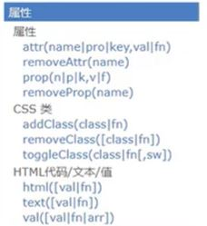

# JQuery
### 为什么要学jquery
使用javascript开发过程中，有许多的缺点：
1.查找元素的方法单一，麻烦。
2.遍历数组很麻烦，通常要嵌套一大堆的for循环。
3.有兼容性问题。
4.想要实现简单的动画效果，也很麻烦
5.代码冗余。
### jquery到底是什么
jQuery的官网 http://jquery.com/
jQuery就是一个js库，使用jQuery的话，会比使用JavaScript更简单。
jQuery is a fast, small, and feature-rich JavaScript library. It makes things like HTML document traversal and manipulation, event handling, animation, and Ajax much simpler with an easy-to-use API that works across a multitude of browsers. With a combination of versatility and extensibility, jQuery has changed the way that millions of people write JavaScript. 
js库：把一些常用到的方法写到一个单独的js文件，使用的时候直接去引用这js文件就可以了。（animate.js、common.js）
jQuery其实就是一个js文件，里面封装了一大堆的方法方便我们的开发，其实就是一个加强版的common.js，学习jQuery，其实就是学习jQuery这个js文件中封装的一大堆方法。
### jquery的版本问题
- 官网下载地址：http://jquery.com/download/
jQuery版本有很多，分为1.x 2.x 3.x
1.x和2.x版本jquery都不再更新版本了，现在只更新3.x版本。
- 大版本分类：
1.x版本：能够兼容IE678浏览器
2.x版本：不能兼容IE678浏览器
3.x版本：不能兼容IE678浏览器，更加的精简（在国内不流行，因为国内使用jQuery的主要目的就是兼容IE678）
- 关于压缩版和未压缩版：
	- jquery-1.12.4.min.js:压缩版本，适用于生产环境，因为文件比较小，去除了注释、换行、空格等东西，但是基本没有颗阅读性。
	- jquery-1.12.4.js:未压缩版本，适用于学习与开发环境，源码清晰，易阅读。
### jQuery的入口函数
- 使用jQuery的三个步骤：
	- 引入jQuery文件
	- 入口函数
	- 功能实现
```html
<!DOCTYPE html>
<html lang="en">
<head>
    <meta charset="UTF-8">
    <title>jQuery入口函数</title>
    <script src="js/jquery-1.12.4.js"></script>
    <script>
        // 1.原生JS的固定写法
        window.onload = function (ev) {  }

        // 2.jQuery的固定写法
        $(document).ready(function () {
            alert("hello lnj");
        });
    </script>
</head>
<body>
</body>
</html>
```
- jQuery入口函数与js入口函数的对比：
	- 1.JavaScript的入口函数要等到页面中所有资源（包括图片、文件）加载完成才开始执行。
	  2.JavaScript如果编写了多个入口函数，后面编写的会覆盖前面编写的
	- 1.jQuery的入口函数只会等待文档树加载完成就开始执行，并不会等待图片、文件的加载。
	  2.jQuery中编写多个入口函数，后面的不会覆盖前面的（依次执行）
```javascript
//jQuery入口函数的四种写法
$(document).ready(function(){
});
jQuery(document).ready(function(){
});
$(function(){   //推荐（最简单）
});
jQuery(function(){
});
```
### jQuery和其他框架冲突的问题
jQuery 使用 $ 符号作为 jQuery 的简写。
如果其他 JavaScript 框架（MooTools、Backbone、Sammy、Cappuccino、Knockout、JavaScript MVC、Google Web Toolkit、Google Closure、Ember、Batman 、Ext JS）也使用 $ 符号作为简写怎么办？
其中某些框架也使用 $ 符号作为简写，如果您在用的两种不同的框架正在使用相同的简写符号，有可能导致脚本停止运行。
jQuery 的团队考虑到了这个问题，并实现了 noConflict() 方法。noConflict() 方法会释放会 $ 标识符的控制，这样其他脚本就可以使用它了。
```
/*方法1.释放$的使用权（释放操作必须在编写其他jQuery代码之前，释放之后不能在使用$，改用jQuery
jQuery.noConflict();
*/
//方法2：自定义一个访问符号
var abc = jQuery.noConflict();
abc(function(){

});
```
### jQuery核心函数
```html
<!DOCTYPE html>
<html lang="en">
<head>
    <meta charset="UTF-8">
    <title>jQuery核心函数</title>
    <script src="js/jquery-1.12.4.js"></script>
    <script>
        // $();   	jQuery的核心函数
        // 1.接收一个函数
        $(function () {
            alert("hello lnj");
            // 2.接收一个字符串
            // 2.1接收一个字符串选择器（返回一个jQuery对象, 对象中保存了找到的DOM元素）
            var $box1 = $(".box1");
            var $box2 = $("#box2");
            console.log($box1);
            console.log($box2);
            // 2.2接收一个字符串代码片段（返回一个jQuery对象, 对象中保存了创建的DOM元素）
            var $p = $("<p>我是段落</p>");
            console.log($p);
            $box1.append($p);
            // 3.接收一个DOM元素（返回一个jQuery对象）
            var span = document.getElementsByTagName("span")[0];
            console.log(span);
            var $span = $(span);
            console.log($span);
        });
    </script>
</head>
<body>
<div class="box1"></div>
<div id="box2"></div>
<span>我是span</span>
</body>
</html>
```
### jquery对象
1. 什么是jQuery对象？—— jQuery对象是一个伪数组
2. 什么是伪数组？—— 有0到length-1的属性，并且有length属性
```
<script>
	$(function () {
		var $div = $("div"); //$div是一个jQuery对象
		console.log($div);
	});
</script>
	
<body>
<div>div1</div>
<div>div2</div>
<div>div3</div>
</body>
```
### 静态方法和实例方法
```javascript
<script>
        // 1.定义一个类
        function AClass() {
        }
        // 2.给这个类添加一个静态方法
        // 直接添加给类的就是静态方法
        AClass.staticMethod = function () {
            alert("staticMethod");
        }
        // 静态方法通过类名调用
        AClass.staticMethod();

        // 3.给这个类添加一个实例方法
        AClass.prototype.instanceMethod = function () {
            alert("instanceMethod");
        }
        // 实例方法通过类的实例调用
        // 创建一个实例(创建一个对象)
        var a = new AClass();
        // 通过实例调用实例方法
        a.instanceMethod();
    </script>
```
### 静态方法each方法
```javascript
<script>
        var arr = [1, 3, 5, 7, 9];
        var obj = {0:1, 1:3, 2:5, 3:7, 4:9, length:5}; //伪数组
    	//原生的forEach方法只能遍历数组, 不能遍历伪数组
        // arr.forEach(function (value, index) {
        //     console.log(index, value);
        // });

        // 利用jQuery的each静态方法遍历数组和伪数组
        //第一个参数: 当前遍历到的索引；第二个参数: 遍历到的元素
        $.each(obj, function (index, value) {
            console.log(index, value);
        });
    </script>
```
### 静态方法map方法
```javascript
<script>
        var arr = [1, 3, 5, 7, 9];
        var obj = {0:1, 1:3, 2:5, 3:7, 4:9, length:5};
        // 1.利用原生JS的map方法遍历,不能遍历的伪数组
        // arr.map(function (value, index, array) {
        //     console.log(index, value, array);
        // });
		
		//和jQuery中的each静态方法一样, map静态方法也可以遍历伪数组
        //第一个参数: 要遍历的数组;第二个参数: 每遍历一个元素之后执行的回调函数
        //回调函数的参数:第一个参数: 遍历到的元素;第二个参数: 遍历到的索引
        var res = $.map(obj, function (value, index) {
            console.log(index, value);
            return value + index;
        });

        var res2 = $.each(obj, function (index, value) {
            console.log(index, value);
        });
		console.log(res);
        console.log(res2);
        /*
        jQuery中的each静态方法和map静态方法的区别:
        each静态方法默认的返回值就是, 遍历谁就返回谁
        map静态方法默认的返回值是一个空数组

        each静态方法不支持在回调函数中对遍历的数组进行处理
        map静态方法可以在回调函数中通过return对遍历的数组进行处理, 然后生成一个新的数组返回
        */
    </script>
```
### jquery其他静态方法
$.trim(); //作用: 去除字符串两端的空格。参数: 需要去除空格的字符串。返回值: 去除空格之后的字符串
$.isWindow(); //作用: 判断传入的对象是否是window对象
$.isArray();//作用: 判断传入的对象是否是真数组
$.isArray();//作用: 判断传入的对象是否是一个函数  
注意点:jQuery框架本质上是一个函数
```
(function( window, undefined ) {

 })( window );
```
### 静态方法holdReady方法
```
<!DOCTYPE html>
<html lang="en">
<head>
    <meta charset="UTF-8">
    <script src="js/jquery-1.12.4.js"></script>
    <script>
        // $.holdReady(true); 作用: 暂停ready执行
        $.holdReady(true);
        $(document).ready(function () {//jQuery的入口函数只会等待文档树加载完成就开始执行，并不会等待图片、文件的加载。
            alert("ready");
        });
    </script>
</head>
<body>
<button>回复ready事件</button>
<script>
    var btn = document.getElementsByTagName("button")[0];
    btn.onclick = function () {
        $.holdReady(false);
    }
</script>
</body>
</html>
```
### jquery内容选择器
:empty 作用:找到既没有文本内容也没有子元素的指定元素`var $div = $("div:empty");`
:parent 作用: 找到有文本内容或有子元素的指定元素`var $div = $("div:parent");`
 :contains(text) 作用: 找到包含指定文本内容的指定元素`var $div = $("div:contains('我是div')");`
:has(selector) 作用: 找到包含指定子元素的指定元素`var $div = $("div:has('span')");`
## 属性及其操作

 1. 什么是属性?
对象身上保存的变量就是属性
 2. 如何操作属性?
 对象.属性名称 = 值;
对象["属性名称"] = 值;
3. 什么是属性节点?
`<span name = "it666"></span>`
在编写HTML代码时,在HTML标签中添加的属性就是属性节点
在浏览器中找到span这个DOM元素之后, 展开看到的都是属性
在attributes属性中保存的所有内容都是属性节点
4. 如何操作属性节点?
 DOM元素.setAttribute("属性名称", "值");
DOM元素.getAttribute("属性名称");
 5. 属性和属性节点有什么区别?
任何对象都有属性, 但是只有DOM对象才有属性节点
### 操作属性相关的方法
- attr(name|pro|key,val|fn)
作用: 获取或者设置属性节点的值
如果传递一个参数, 代表获取属性节点的值
如果传递两个参数, 代表设置属性节点的值
注意点:
如果是获取:无论找到多少个元素, 都只会返回第一个元素指定的属性节点的值
如果是设置:找到多少个元素就会设置多少个元素。如果设置的属性节点不存在, 那么系统会自动新增
- removeAttr(name)
删除所有找到元素指定的属性节点
- prop方法
特点和attr方法一致
- removeProp方法
特点和removeAttr方法一致
注意点:
prop方法不仅能够操作属性, 还能操作属性节点
官方推荐在操作属性节点时,具有 true 和 false 两个属性的属性节点，如 checked, selected 或者 disabled 使用prop()，其他的使用 attr()
```
//attr和prop方法练习
<!DOCTYPE html>
<html lang="en">
<head>
    <meta charset="UTF-8">
    <script src="js/jquery-1.12.4.js"></script>
    <script>
        $(function () {
            // 1.给按钮添加点击事件
            var btn = document.getElementsByTagName("button")[0];
            btn.onclick = function () {
                // 2.获取输入框输入的内容
                var input = document.getElementsByTagName("input")[0];
                var text = input.value;
                // 3.修改img的src属性节点的值
                $("img").attr("src", text);
                // $("images").prop("src", text);
            }
        });
    </script>
</head>
<body>
<input type="text">
<button>切换图片</button><br>

</body>
</html>
```
### 操作类相关的方法
1. addClass(class|fn)
作用: 添加一个类
如果要添加多个, 多个类名之间用空格隔开即可
2. removeClass([class|fn])
作用: 删除一个类
如果想删除多个, 多个类名之间用空格隔开即可
3. toggleClass(class|fn[,sw])
作用: 切换类
有就删除, 没有就添加
### 操作文本值相关的方法
 1. html([val|fn])
和原生JS中的innerHTML一模一样
2. text([val|fn])
和原生JS中的innerText一模一样
3. val([val|fn|arr])
可以操作input的value
## 操作CSS样式的方法
1.逐个设置
```
$("div").css("width", "100px");
$("div").css("height", "100px");
$("div").css("background", "red");
```
2.链式设置
注意点: 链式操作如果大于3步, 建议分开
`$("div").css("width", "100px").css("height", "100px").css("background", "blue");`
3.批量设置（推荐）
```
$("div").css({
	width: "100px",
	height: "100px",
	background: "red"
});
```
4.获取CSS样式值
`console.log($("div").css("background"));;`
### jquery位置和尺寸操作方法
```
// 获取元素的宽度
// console.log($(".father").width());
// offset([coordinates])
// 作用: 获取元素距离窗口的偏移位
// console.log($(".son").offset().left);
// position()
// 作用: 获取元素距离定位元素的偏移位
console.log($(".son").position().left);

// 设置元素的宽度
// $(".father").width("500px")
// $(".son").offset({
//     left: 10
// });
// 注意点: position方法只能获取不能设置
```
### jQuery的scrollTop方法
获取滚动的偏移位
`console.log($(".scroll").scrollTop())`
获取网页滚动的偏移位(为了保证浏览器的兼容, 获取网页滚动的偏移位需要按照如下写法)           `console.log($("body").scrollTop()+$("html").scrollTop());`
